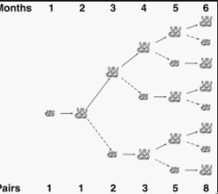

# recursion 2

## 1. Factorial

```cs
int factorial(int n) {
  if (n == 1)
    // caso base
  return 1;

  return n * factorial(n - 1);
}
```

## 1.1. Iterative

```ts
function factorial(n: number): number {
  let result = 1;
  for (let i = 2; i <= n; i++) {
    result *= i;
  }
  return result;
}
```

## 2. Fibonacci

sequenza infinita di numeri interi in cui ogni numero è la somma dei due numeri
precedenti

infinto

casi base sono 0 e 1

````ts

### 2.1. Iterative

```ts
function fibonacci(n: number): number {
  if (n <= 1) return n;
  let fib = 1;
  let prevFib = 1;

  for (let i = 2; i < n; i++) {
    const temp = fib;
    fib += prevFib;
    prevFib = temp;
  }

  return fib;
}
````

# conigli di fibonacci



applied to many things

sezione aurea costruita su fibonacci

## i tre ingredienti della ricorsione

1. decomposizione
2. caso base o passo ricorsivo
3. composizione

## algoritmo di euclide per il MCD (massimo comune divisore)

dati due numeri a e b, con a > b, il MCD è il più grande numero che divide a e b

```ts
function mcd(a: number, b: number): number {
  if (b === 0) return a;
  return mcd(b, a % b);
}
```

caso base: b === 0

# recursive problems

all recursive steps till base case is memory in stack ( can be huge )

## recursive calls are slower and more expensive

easier to write and understand

## exercise

conta lettere ricorsivamente

# lo scopo della ricorsione

scomporre un problema in sottoproblemi più piccoli e semplici

tendenzialmente non è la soluzione più efficiente e non si usa

piu semplice della versione iterativa

# caml ocaml and tendenzialmente functional programming is recursive (f#)

imperative, declarative

# una parola palindroma

una parola che si legge allo stesso modo da sinistra a destra e viceversa

- stringa vuota e' palindroma?
- 1 sola lettera e' palindroma?

# es per casa

moltiplicazaioe usando solo somme, metodo delle addizioni successive
