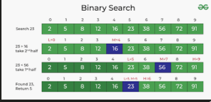

# definizione

algoritmo di ricerca

sequenza di passi, da sequenza di elementi restituisce la posizione
dell'elemento cercato se presente o null se non

# ricerca intuitiva sequenziale

ricerca iterativa sequenziale, 1 by 1, loop non efficiente, solo se non si hanno
piu informazioni

# si puo' fare di meglio?

copilot: ricerca binaria o dicotomica, divide et impera

recursion

1. controlla elemento in Mezzo
2. se maggiore richiama funzione sulla seconda meta
3. se il valore è minore richiama funzione sulla prima meta
4. se uguale restituisce valore fine
