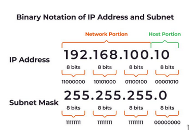
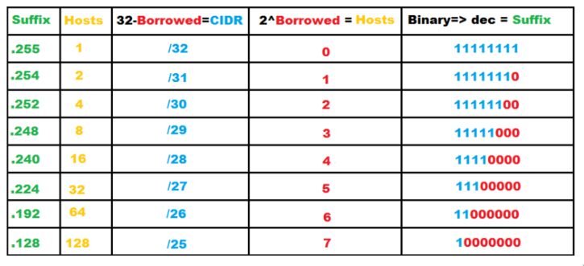
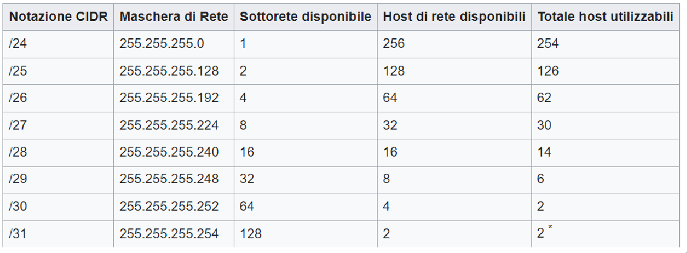

# subnetting only for private IPS

Il processo di subnetting è la divisione di una singola rete in gruppi di
computer che hanno in comune in ciascun indirizzo IP un determinato prefisso di
routing..

## rete di tipo b

534 max pc

se ho piu di 300 pc

172.192.... e definisco sottoreti

## tipo c

192.168

