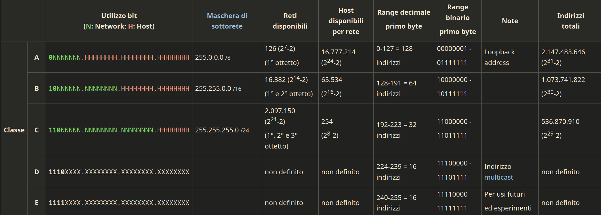
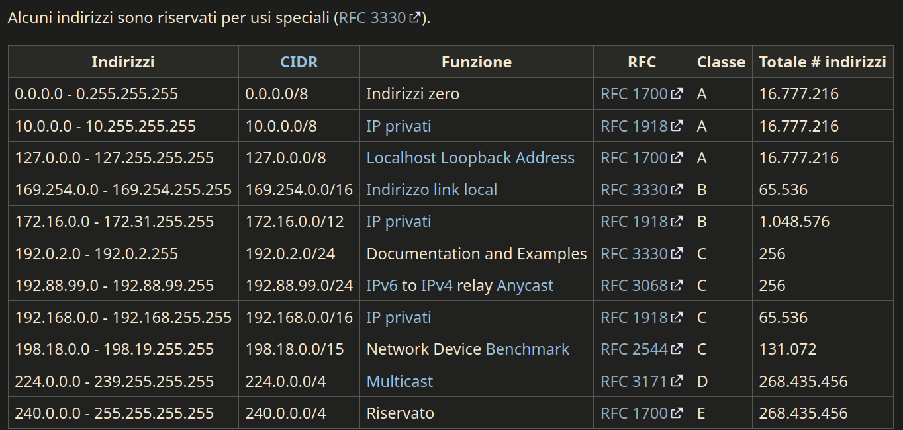

# indirizzo IP

<!--toc:start-->

- [indirizzo IP](#indirizzo-ip)
  - [IPv4](#ipv4)
  - [classi IP](#classi-ip)
  - [indirizzi riservati](#indirizzi-riservati)
  - [annotazioni abbreviate](#annotazioni-abbreviate)
  - [how dns mask numbers work](#how-dns-mask-numbers-work)
  <!--toc:end-->

internet protocol address

indirizzo univoco assegnato ad ogni dispositivo connesso ad una rete che
utilizza il protocollo IP

identifica univocamente un host in una rete

## IPv4

32 bit 4 groups

0-255 in each byte

0/24 = 0-255.0-255.0-255.0-255 because 24 bits are used for the network address
and 8 for the host address

## classi IP

- class a: subnet 255.0.0.0/8,

  Il primo byte rappresenta la rete; gli altri tre gli host per ogni rete. In
  notazione decimale gli IP variano nel modo seguente: 0-127.H.H.H; La maschera
  di rete è 255.0.0.0 (o anche detta /8 in quanto i bit di rete sono 8); Questi
  indirizzi in binario iniziano con il bit 0.

- class b: subnet 255.255.0.0/16

  I primi due byte rappresentano la rete; gli altri due gli host per ogni rete.
  In notazione decimale gli IP variano nel modo seguente: 128-191.N.H.H; N varia
  da 0 a 255. La maschera di rete è 255.255.0.0 (o anche detta /16 in quanto i
  bit di rete sono 16); Questi indirizzi in binario iniziano con i bit 10.

- class c: subnet 255.255.255.0/24

  I primi tre byte rappresentano la rete; l'ultimo gli host per ogni rete. In
  notazione decimale gli IP variano nel modo seguente: 192-223.N.N.H; La
  maschera di rete è 255.255.255.0 (o anche detta /24 in quanto i bit di rete
  sono 24); Questi indirizzi in binario iniziano con i bit 110.

## indirizzi riservati

## annotazioni abbreviate

/8 /16 /24 /64 /128

/64 = 4pc network

in a subnet mask with /24, 24 bits are used for the network address and 8 for
the host address

this means there are 24 number 1s and 8 number 0s

- 255.255.255.0/24 = 11111111.11111111.11111111.00000000

  11111111 is 255 in binary

- 255.0.0.0/8 = 11111111.00000000.00000000.00000000

- 255.255.255.224/27 = 11111111.11111111.11111111.11100000

  11100000 is 224 in binary

the more 1 you add, the less hosts you can have

## how dns mask numbers work

every 1 added convert byte into binary, / is the number of 1s (whole subnet)

- 10000000 = 128 = /25 = 126 host
- 11000000 = 192 = /26 = 62 host
- 11100000 = 224 = /27 = 30 host
- 11110000 = 240 = /28 = 14 host
- 11111000 = 248 = /29 = 6 host
- 11111100 = 252 = /30 = 4 host
- 11111110 = 254 = /31 = 2 host
- 11111111 = 255 = /32 = 1 host
