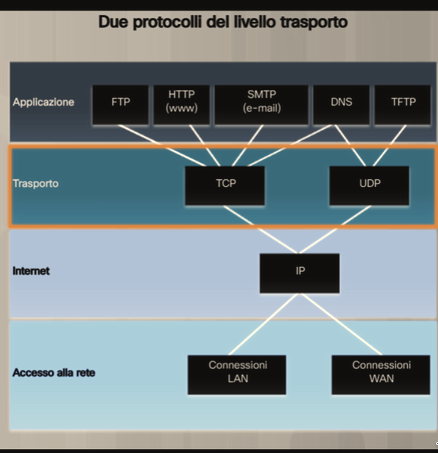

# Dispositivi di una rete

<!--toc:start-->

- [Dispositivi di una rete](#dispositivi-di-una-rete)
  - [dispositivi host](#dispositivi-host)
  - [dispositivi intermedi](#dispositivi-intermedi)
  - [mezzi trasmissivi](#mezzi-trasmissivi)
  - [tipi di network](#tipi-di-network)
  - [modello tcp/ip](#modello-tcpip)
  - [tcp](#tcp)
  - [UDP](#udp)
  - [classificazione dei numeri delle porte piu usate](#classificazione-dei-numeri-delle-porte-piu-usate)
  <!--toc:end-->

## dispositivi host

tutti i device connessi ad una rete ( end devices ) alla fine o al bordo di una
rete

## dispositivi intermedi

dispositivi di rete che forniscono connettivita' e servizi per consentire la
comunicazione tra i dispositivi terminali

- switch
- Router
- router wireless
- modem
- access point

## mezzi trasmissivi

fornisce il canale fisico attraverso il quale i segnali viaggiano da un
dispositivo

connessione lan, wan, wireless, cloud

- cavo coassiale
- cavo in fibra ottica
- cavo Ethernet
- cavo DSL

## tipi di network

- PAN personal area network
- LAN local area network
- WLAN wireless local area network
- WMN wireless mesh Network
- MAN metropolitan area Network
- WAN wide area Neat work
- VPN virtual private Network

## modello tcp/ip

- applicazione ( http, ftp, smtp, dns )
- transporto ( tcp, udp )
- internet ( ip )
- accesso alla rete ( ethernet, wifi, dsl )

## tcp

trasmissione controllata, affidabile. Richiede acknoledgement ( ACK ) per ogni
pacchetto ricevuto e three way handshake per stabilire la connessione.

## UDP

trasmissione non controllata, non affidabile. Non richiede acknoledgement ( ACK
) per ogni pacchetto ricevuto e non richiede three way handshake per stabilire
la connessione.

## classificazione dei numeri delle porte piu usate

- 0-1023: well known ports
- 1024-49151: registered ports
- 49152-65535: dynamic ports

| Port Number | Usage                           |
| ----------- | ------------------------------- |
| 20          | FTP - Data Transfer             |
| 21          | FTP - Command Control           |
| 22          | SSH                             |
| 23          | Telnet                          |
| 25          | SMTP - E-mail Routing           |
| 53          | DNS service                     |
| 80          | HTTP                            |
| 110         | POP3 - E-mail Retrieval         |
| 119         | NNTP                            |
| 123         | NTP                             |
| 143         | IMAP - Digital Mail Management  |
| 161         | SNMP                            |
| 194         | IRC                             |
| 443         | HTTPS                           |
| 465         | SMTP over SSL                   |
| 587         | SMTP over TLS                   |
| 990         | FTP over SSL                    |
| 993         | IMAP over SSL                   |
| 995         | POP3 over SSL                   |
| 1433        | Microsoft SQL Server            |
| 1521        | Oracle database                 |
| 3306        | MySQL                           |
| 3389        | Remote Desktop Protocol         |
| 5432        | PostgreSQL                      |
| 5631        | pcAnywhere data                 |
| 5632        | pcAnywhere control              |
| 5900        | Virtual Network Computing (VNC) |
| 6000-6003   | X Window System                 |
| 8080        | HTTP Alternate                  |
| 8443        | HTTPS Alternate                 |
