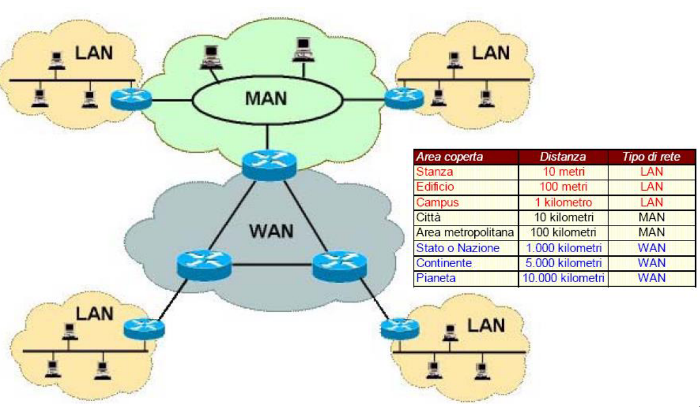
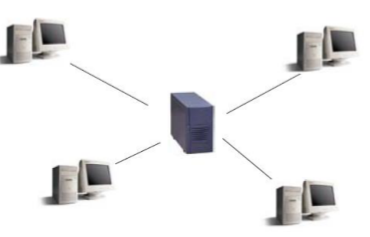
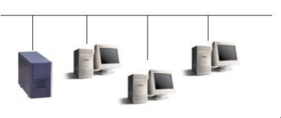
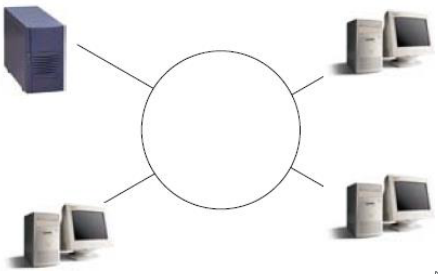
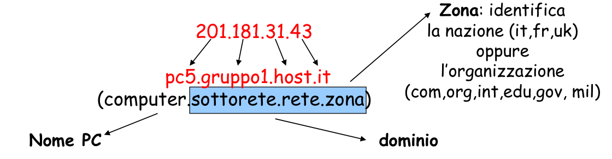

# evoluzione tech comunicazioni = necessita' di condivisione delle info

<!--toc:start-->

- [evoluzione tech comunicazioni = necessita' di condivisione delle info](#evoluzione-tech-comunicazioni-necessita-di-condivisione-delle-info)
  - [tech informatica e comunicazioni](#tech-informatica-e-comunicazioni)
    - [reti ( network )](#reti-network)
    - [tipi di reti](#tipi-di-reti)
    - [mezzi trasmissivi di una rete](#mezzi-trasmissivi-di-una-rete)
      - [guidati](#guidati)
      - [non guidati](#non-guidati)
    - [hardware di rete](#hardware-di-rete)
    - [reti e telefonia](#reti-e-telefonia)
    - [tipi di trasmissione telefonica](#tipi-di-trasmissione-telefonica)
      - [pstn public switched telephone network](#pstn-public-switched-telephone-network)
      - [isdn integrated services digital network](#isdn-integrated-services-digital-network)
      - [adsl asymmetric digital subscriber line](#adsl-asymmetric-digital-subscriber-line)
  - [topologia di rete](#topologia-di-rete)
  - [architettura](#architettura)
    - [architettura client server](#architettura-client-server)
    - [peer to peer](#peer-to-peer)
  - [protocolli di rete](#protocolli-di-rete)
  - [tcp/ip](#tcpip)
  - [www](#www)
  - [ISP](#isp)
  - [browser](#browser)
  - [motori di ricerca](#motori-di-ricerca)
  - [posta elettronica](#posta-elettronica)
  <!--toc:end-->

## tech informatica e comunicazioni

interconnessione di pc a livello aziendale e mondiale

### reti ( network )

insieme di sistemi per elaborazione di informazioni che consentono la
comunicazione di informazioni e condivisione di risorse e servizi

### tipi di reti

- LAN local area network

connessi mediante schede di rete e cavi tra questse ci sono le WLAN

- MAN metropolitan area network

come lan ma su aree piu' vaste

- WAN wide area network

numero elevatissimo di pc connessi tra loro mediante cavi e satelliti

### mezzi trasmissivi di una rete

#### guidati

canale di tipo fisico

- doppino telefonico ( rame )
- cavo coassiale ( rame ricoperto da isolante e calza metallica ad alta
  trasmissione )
- fibra ottica ( impulsi luminosi)

#### non guidati

segnale irradiato nello spazio

- onde radio
- cellulare
- satelliti

### hardware di rete

scheda di rete

### reti e telefonia

segnale analogico ( varia in modo continuo nel tempo ) senale digitale ( varia
in modo binario nel tempo )

### tipi di trasmissione telefonica

#### pstn public switched telephone network

#### isdn integrated services digital network

#### adsl asymmetric digital subscriber line

## topologia di rete

1. topologia a stella

reti geo e locali

2. topologia lineare

due reti locali di pc

3. topologia ad anello

reti locali di pc ( traffico piu elevato )

## architettura

### architettura client server

1 server che fornisce servizi a piu' client

### peer to peer

ogni pc e' sia client che server

## protocolli di rete

insieme di regole che definiscono il formato dei messaggi e le procedure per lo
scambio di messaggi

### tcp/ip

tcp trasmission control protocol / ip internet protocol

### www

world wide web info scambiate in hypertext (html = hyper text markup language)

- ipertesto

insieme di documenti con nesso comune che possono essere consultati in modo non
sequenziale e non lineare mediante collegamenti ipertestuali

bassato su protocollo http ( hyper text transfer protocol )

### ISP

internet service provider

fornisce servizi di connessione a internet

### browser

### motori di ricerca

### posta elettronica
