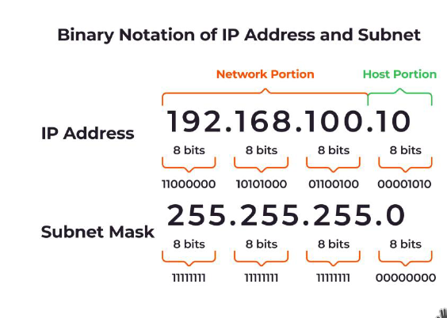
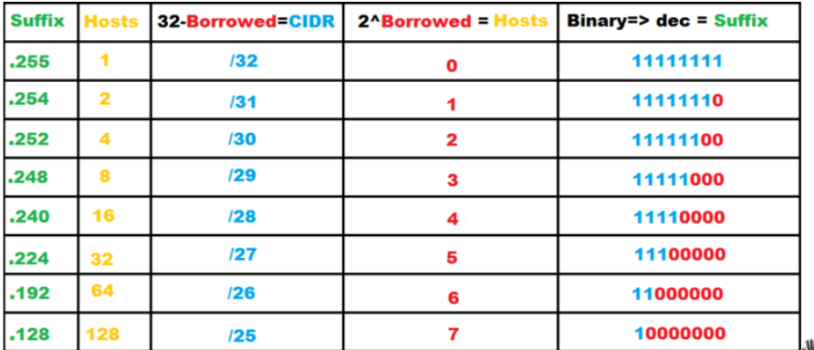
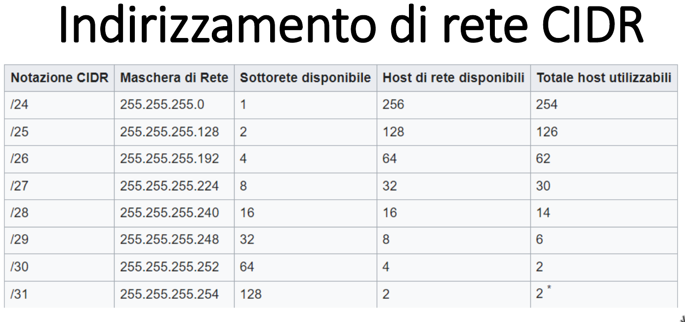

# subnetting

binary notation of IP address and subnet

## subnet

pate della suddivisone di una singola rete IP,

## subnetting

divisione di una singola rete in gruppi di computer che hanno in comune in
ciascun indirizzo IP un determinato prefisso di routing

- divide rete in piccoli intervalli
- impediscono eccessivi tassi di collisione

organizzate logicamente in un'architettura gerarchica.

router utilizzati per lo scambio di traffico tra sottoreti.

costituiscono i confini logici e fisici tra subnet

gestiscono il traffico tra le sottoreti

## prefissi di routing

CIDR ( classless interdomain routing )

192.168.1.0/24

24 bit per la rete e 8 per l'host

## collegamenti

tutti gli host sono collegabili da 1 hop

si puo collegarli con uno stesso link

## indirizzamento di rete

ciascun end device ha 1 indirizzo di rete

identifica host e localizza.

ipv4 - 32 bit

ipv6 - 128 bit

1. netID

2. host

# in ipv6 cidr e' obbligatorio

esempio: 2001:0db8:85a3:0000:0000:8a2e:0370:7334/64

